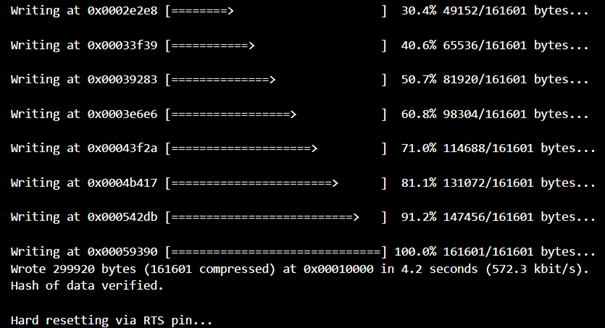
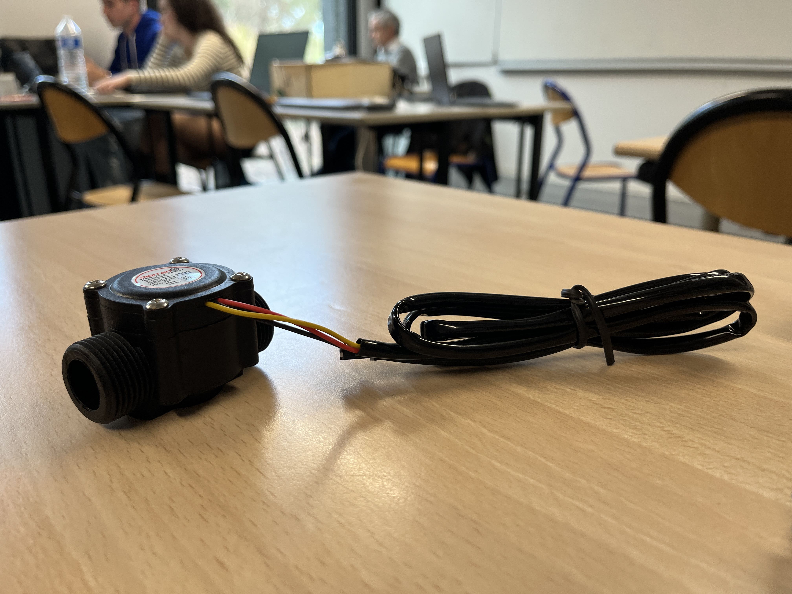
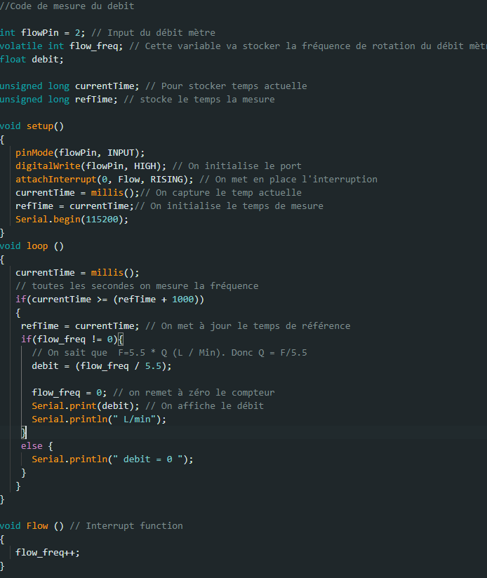

<body>
    <h1> Compte Rendu Semaine / W41</h1>
    <h2>Découverte du projet et répartition des tâches</h2>
    
En premier lieu, nous avons découvert le matériel que nous allons utiliser pour notre projet de contrôle de source. Par la suite, notre professeur nous a expliqués plus en détails les attentes qu'il avait pour ce projet et la piste que l'on doit explorer.

    
Pour atteindre notre but, nous avons à notre disposition : 
        <ul>
        <li>1 carte ESP32 Wifi LoRa pour piloter nos composants ;</li>
        <li>2 transmetteurs GSM pour envoyer les données voulues ;</li>
        <li>1 débit mètre pour mesurer le débit de débordement de la source ;</li>
        <li>1 capteur de distance ultrasonic Arduino pour mesurer en temps réel le niveau de l'eau de la source.</li></ul>
    

    
Dans un deuxième temps, nous nous sommes réparti les tâches à effectuer. Pour commencer, Matthis et moi sommes en charge de l'écriture du code pour lire les données de nos 2 capteurs. Matthis se charge du code pour le capteur de distance et moi du débit mètre.

    <h2>Initialisation de la carte</h2>
    
Dans un premier temps, j'ai branché la carte ESP32 à mon ordinateur mais elle n'était pas détectée. Cela était dû à un problème de pilotes (Drivers). J'ai pu m'aider <a href="https://randomnerdtutorials.com/installing-esp32-arduino-ide-2-0/">de ce site</a> dans la section Troubleshooting pour l'installation du pilote.

    
    

    Après ça, nous avons remarqué que cette carte renvoyait des caractères spéciaux sur le port série ; cela est dû au type de carte sélectionné dans l'IDE Arduino lors de la compilation. Au départ, j'ai sélectionné le type de carte <strong>ESP32 Dev Module</strong> mais pour régler ce problème il faut utiliser <strong>Heltec WiFi LoRa 32</strong>.

    <h2>Écriture du code</h2>
    
On a pu finalement commencer à écrire le code pour relever les données du débit mètre. Le modèle utilisé est un <a href="https://www.digiten.shop/products/digiten-g3-4-water-flow-hall-sensor-switch-flow-meter-1-60l-min">DIGITEN G3/4</a> qui peut être alimenté en 5V et qui mesure un débit compris entre 1L/min et 60L/min. Il se branche sur un port numérique de la carte. Dans notre cas, le port 2.

    
    
Sur la doc de la pompe, il est marqué que la fréquence de rotation est expliquée par cette formule : $F=5.5 \times Q \text{ (L / Min)}$. Donc le débit se note $Q = F/5.5$ avec $F$ le nombre d'impulsion qu'envoie le débit mètre. De plus, pour ce code, nous allons utiliser les interruptions pour incrémenter le compteur de la fréquence. À chaque fois que l'on détecte une impulsion sur le port 2, on incrémente le compteur. Avec cette donnée, on pourra calculer le débit en L/min.

    
    
En voulant tester le code, il n'arrivait pas à se flasher alors que les branchements étaient bons. Pour résoudre le problème, nous avons flashé le code sans brancher le débit mètre, et c'est seulement après avoir réussi à le flasher que nous avons connecté le débit mètre. Le dispositif fonctionne correctement.

    <h2>Prochaine séance</h2>
    
L'objectif de la prochaine séance sera de faire fonctionner en même temps le débit mètre et le capteur ultrasonic.

</body>