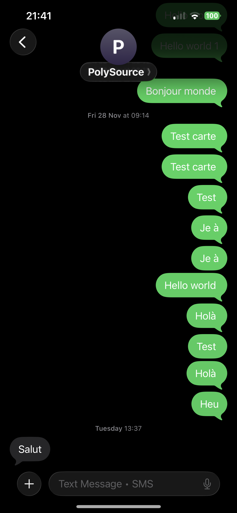

# Compte Rendu Semaine 8 / W5 (03/02/2026)

## Test d'envoie du SMS

Après avoir réussi à résoudre les problèmes de connexions de la carte avec les antennes (La carte n'était pas connectée au réseau LTE car l'APN était mauvais), on a voulu tester si on pouvait envoyer des SMS. Après avoir reconfiguré le mode SMS, j'ai enfin pu envoyer un SMS avec le module GSM. On a désormais la certitude que la carte peut envoyer des données.

## Essaie de communication MQTT

Après ce succès, il fallait réussir à établir la connexion entre le GSM et le serveur MQTT. Pour faciliter les tests, j'ai utilisé le compte associé à HiveMQ sur mon PC pour éviter de ralentir la deuxième équipe.
Après plusieurs tentatives de connexion en utilisant USR_CAT1, la connexion reste impossible même si on utilise les bons identifiants de connexion ainsi que le certificat SSL par défaut du brocker. Même en configurant la connexion vers **broker.hivemq.com** et au port **1883** non sécurisé, la connexion ne se faisait pas.
Les problèmes de connexions restent flous. En effet, nous avons configuré le bon APN (free), nous avons une bonne réception ( > 15) et une IP, ce qui confirme que le GSM peut établir une connexion à internet. 
L'une des hypothèses est que le code de réception de la commande **AT+CSQ** est 2 : GSMR/GSM alors que l'on veut le code 4 : LTE. Peut-être que le fait que le code ne soit pas 4 empêche la connexion.

## Essaie de résolution connexion MQTT

Le plus gros problème de ce module GSM est le jeu de commande AT utilisé. Elles sont issues d'une bibliothèque propriétaire limitante, on doit alors se fier aux commandes propriétaires.
On a ensuite découvert que la commande **AT+SOCKALK?** Permet de vérifier si ce socket est connecté à l'adresse configurée et elle ne l'était pas.
Réponse à la commande:
AT+SOCKALK?

+SOCKALK:Disconnected

Cela signifie que la connexion entre le module et l'adresse enregistrée dans le socket n'est pas possible. On vérifie alors la configuration et on trouve que le socket essaie de se connecter à socket.usr.cn,2317. Cela pourrait expliquer le fait que le GSM n'arrive pas à se connecter au brocker, il essaierait de se connecter au serveur sur mais il n'y arrive pas car aucun ID et mot de passe sont configurés pour s'y connecter.
Réponse à la commande:
AT+SOCKA

+SOCKA:TCP,socket.usr.cn,2317

On met à jour le socket avec **broker.hivemq.com** et le port **1883**, on a alors AT+SOCKA=TCP,broker.hivemq.com,1883. En effectuant le test, on obtient alors une réponse positive +SOCKALK:Connected mais seulement en mode NET (AT+WKMOD=NET), le module arrive à se connecter via le mode NET

En essayant de se connecter avec l'adresse de notre brocker et le port **8883**, on a une réponse négative. Cela est normal car dans ce mode le certificat SSL n'est pas fourni. On a alors imaginé une solution, utilisant la puissance de l'ESP-32 pour encrypter et transmettre les données au GSM qui s'occupera seulement d'envoyer les chaînes de caractères au serveur. Pour cela, nous pensons utiliser les Bibliothèques Arduino TinyGSM et PubSubClient, la première servira à communiquer avec le GSM via le port série et les commandes AT, et la deuxième à publier sur le brocker MQTT.

## Prochaine séance

Explorer la piste des bibliothèques trouvées.
