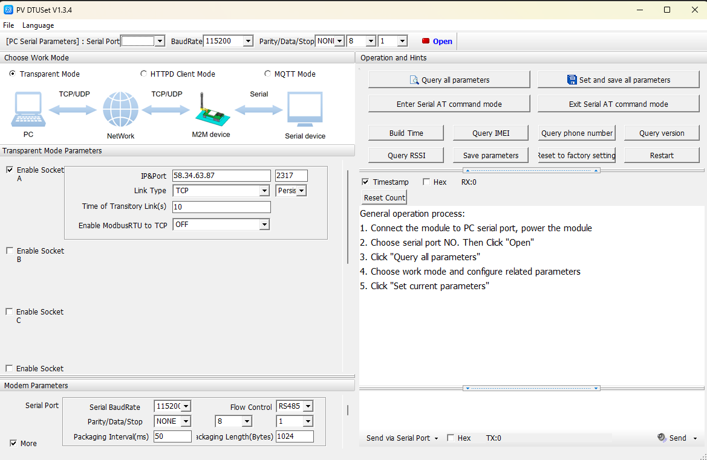
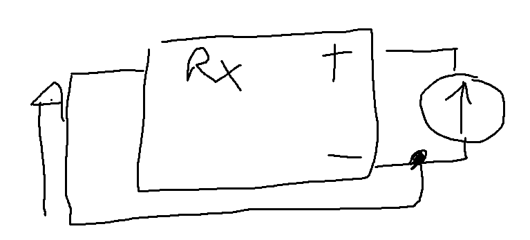
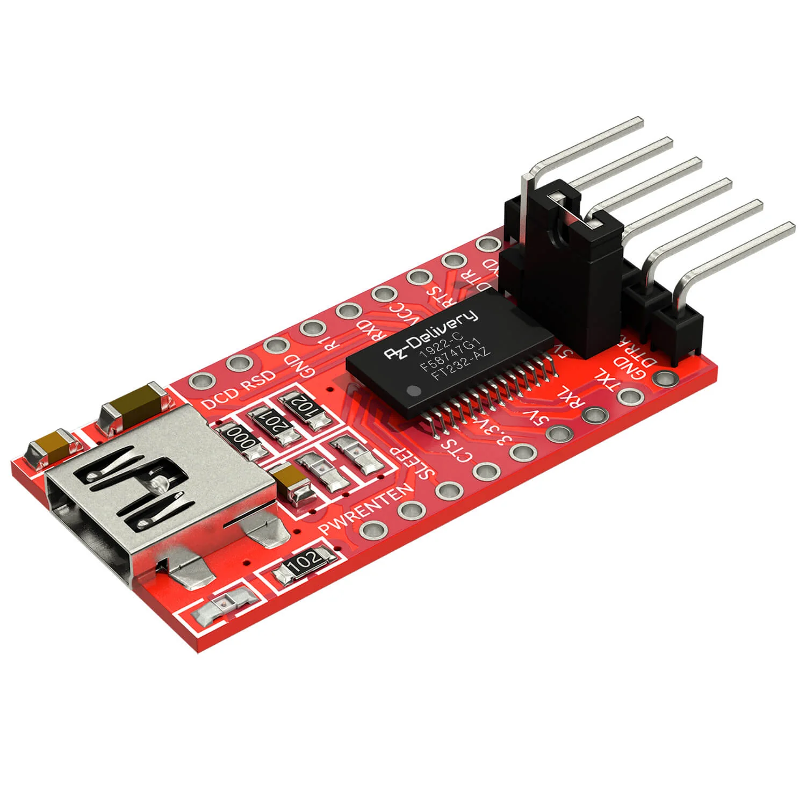

# Compte Rendu Semaine 10 / W10 (05/03/2026)

## Connexion GSM 

Durant cette séance, on a repris l'essai de la communication entre le le GSM et l'ordinateur. En effet, on utilise désormais le USR-DR154 car on s'est aperçu que celui-ci avait des commandes MQTT dans sa bibliothèque constructeur, ce que le précédent n'avait pas. Pour configurer ce nouveau GSM, on utilise un nouveau logiciel propriétaire, semblable à celui utilisé par le passé.

Pour se connecter, on utilise le câble USB-Series que l'on a déjà utilisé pour communiquer avec le WH-LTE-7S1. Pour la connexion, il fallait réinstaller le driver PL2303 pour faire la conversion entre US et série par le software. Cette solution n'a pas fonctionné.
Dans un premier temps, on s'est dit que c'était un problème de branchement, sur le module on a un GND et un -VCC et on ne savait si ces 2 ports étaient connectés. Après mesure avec un voltmètre, il s'avère que ces 2 ports sont liés. Même après cela, la connexion ne se fait pas.

On utilise alors le module FT232RL qui permet de créer une liaison série-USB via un module hadware. Cependant, on n'a pas réussi à le connecter. 
Pendant la séance, mon PC a été victime d'une surtension, ce qui a empêché son utilisation à la fin du cours.

## Prochaine séance

Approfondir la piste de la connexion via FT232RL.
