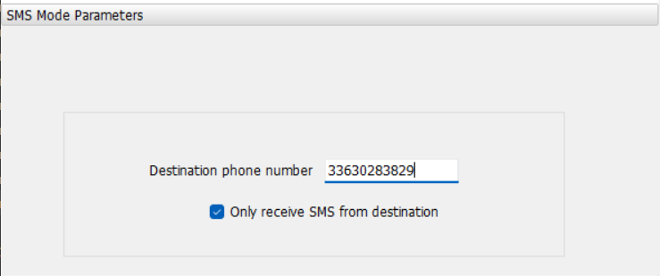

# Compte Rendu Semaine 11 / W12 (17/03/2026)

## Explication du projet au prof

En début de séance, le prof est venu constater l'avancé du projet. On lui a montré que le WH-LTE-7S1 été configurer de tel sorte que la conversation SMS est fonctionnel. Pour envoyer des SMS il faut enregistrer le numéro de destination dans la section de configuration, il faut aussi configurer les bon IPN (free) et verifer que le GSM est connecté à une antenne (Led net allumé sur la carte) on peut aussi le vérifer à l'aide du . Une fois configurer, le WH-LTE-7S1 redemarre et se met en mode Transparent, ce qui permet d'envoyer des SMS sans utiliser les commandes AT, on reçoit aussi les SMS de la même manière.

## Connexion entre FT232RL et le USR-DR154

Le module FT232RL est conçu pour faire la conversion de signal entre le port série RS232 / TTL vers USB. Le module se connecte aux ports UART du WH-LTE-7S1 puis via un cable USb, se connecte au PC. Bien que le module hardware fonctionne, le module GSM USR-DR154 utilise un port série RS485, ce qui signifie que le FT232RL ne peut pas être utilisé directement pour la connexion. Malheureusement, nous n'avons pas de module de conversion RS485 à TTL à notre disposition, ce qui empêche la connexion directe entre le FT232RL et le USR-DR154.
Il faut attendre la commande du module de conversion pour pouvoir établir la connexion et tester la communication avec le USR-DR154. En attendant, nous avons mis en ligne les exécutables sur GitHub pour que le professeur puisse les tester et les utiliser pour la suite du projet.

## Mise en ligne des executables sur github

Puisque l'on doit attendrela commande du module de conversion, on a mis en ligne les executables sur github pour que le prof puisse les tester et les utiliser pour la suite du projet. Les exécutables sont disponibles dans le répertoire "Exécutables" du dépôt GitHub, avec des instructions détaillées sur leur utilisation et leur configuration.

## Essaie d'Eagle pour conception PCB

On a installé le logiciel de conception de PCB Eagle pour commencer à concevoir la carte qui intégrera les différents composants du projet. Nous avons alors pris en mains l'outils et ajouté les connecteurs pour les différents composants, tels que les modules GSM, l'ESP32, le module HC-05 et le débitmètre. Nous avons aussi commencé à réfléchir à la disposition des composants sur la carte pour optimiser l'espace et faciliter les connexions entre eux. Cependant, nous n'avons pas encore finalisé la conception de la carte, car nous devons d'abord attendre la réception du module de conversion RS485 à TTL pour pouvoir tester la communication entre les différents composants.

## Prochaine séance

Approfondir la piste de la connexion via FT232RL.
