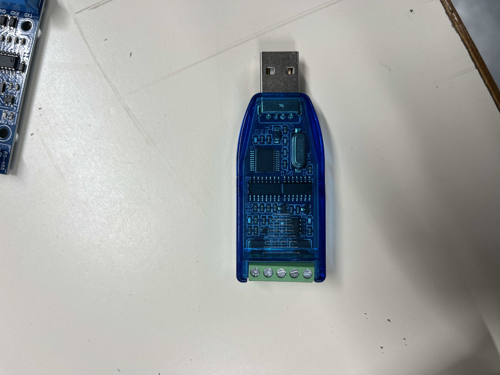
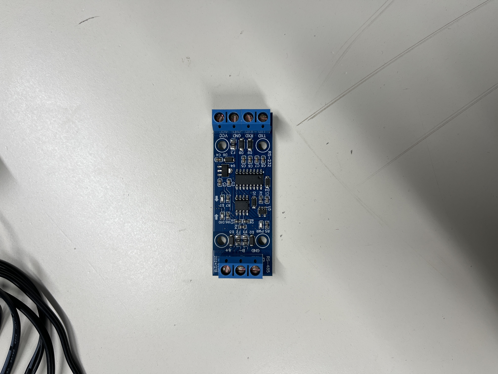

# Compte Rendu Semaine 12 / W14 (03/04/2026)

## Reception du module de conversion RS485 à TTL

Nous avons reçu les modules de conversion RS485. Un des adaptateur et de USB-RS485 qu'on utilisera pour la configuration de l'USR. Le deuxième est un adaptateur entre RS232-RS485, ce module permettra la communication entre l'ESP32 et le module GSM. Pour rappelle, l'ESP32 ne supporte pas la communication RS485, c'est pour cela que nous avons besoin de ce module de conversion pour pouvoir communiquer avec le module GSM qui utilise la communication RS485.

Une fois les branchements vers le PC effectués, on a pu tester la communication entre le PC et le module de conversion RS485 à TTL en utilisant les commandes AT. Nous avons réussi à établir une communication stable entre le PC et le module de conversion, ce qui nous a permis de configurer le module GSM pour qu'il puisse communiquer avec l'ESP32 via la communication RS485.
Cependant la configuration MQTT reste compliquée, le GSM ne se connecte pas au broket MQTT, on a essayé plusieurs commandes AT pour configurer la connexion MQTT, mais sans succès. En feuillant la documentation des commandes AT du module GSM, on a trouvé une commande AT+SSLCFG qui permet de configurer les paramètres de sécurité pour la connexion MQTT, mais cette commande n'est pas reconnu par le firmware du module GSM. J'ai donc contacté le support technique du fabricant du module GSM pour demander une mise à jour du firmware qui inclut la prise en charge de la commande AT+SSLCFG.
En attendant une réponse, Mathis a essayé une autre approche.

## Mise a jour du code

Une autre tâche effctué et la mise à jour du code pour que l'ESP32 puisse convertir les donées reçues du débitmètre/sonar en format JSON et les envoyer au broker MQTT. Nous avons utilisé la bibliothèque ArduinoJson by Benoit Blanchon pour la convertion. Cependant, le code est encore en cours de développement.

## Prochaine séance

Continuer à travailler sur la configuration du module GSM pour qu'il puisse se connecter au broker MQTT et envoyer les données du débitmètre/sonar. Nous allons également continuer à développer le code pour que l'ESP32 puisse convertir les données en format JSON et les envoyer au broker MQTT.
