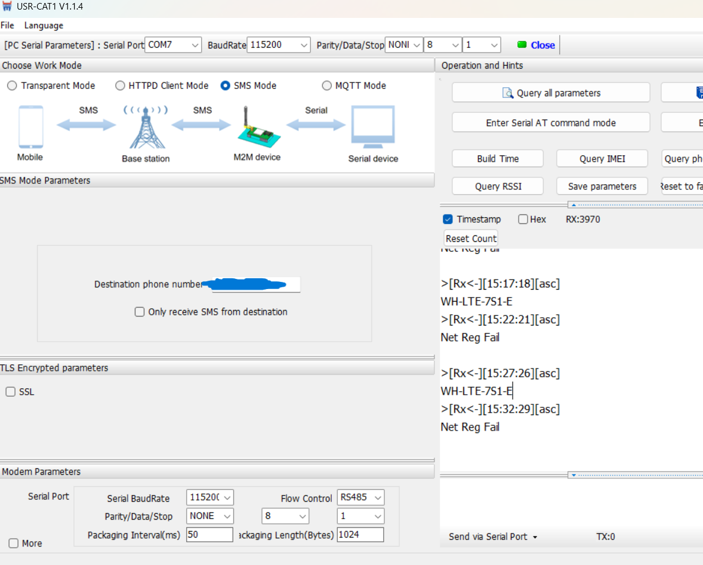
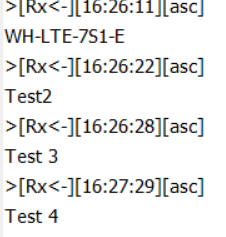
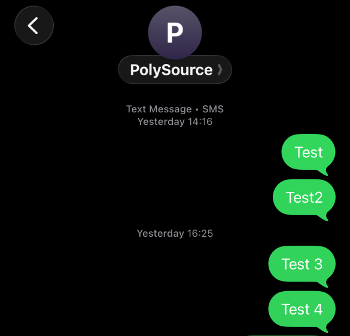
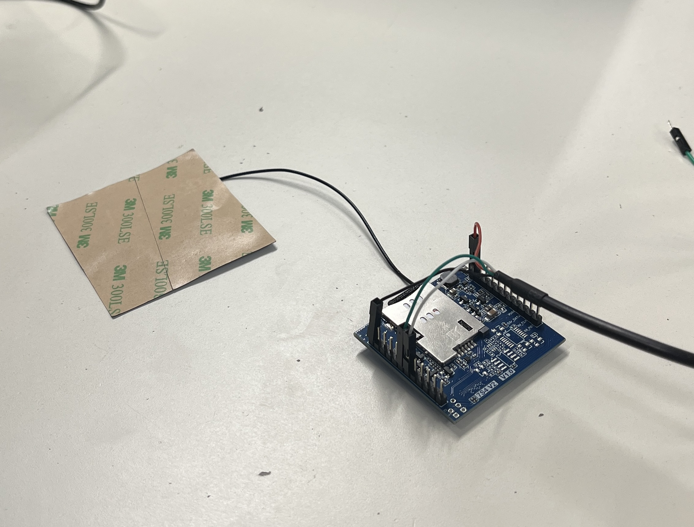

# Compte Rendu Semaine 5 / W48 (27/11)

## Communication avec le module via envoi de SMS

Pour ne pas dépendre de l'ordinateur de mon collègue Matthis pour la configuration du GSM, j'ai de nouveau recherché les bons drivers de communication USB-Serie avec le GSM WH-LTE-7S1-E et j'ai mis la main sur un [tuto](https://github.com/theAmberLion/Prolific?tab=readme-ov-file) qui m'explique comment avoir la bonne version des drivers pour communiquer avec la carte sous Windows 11. En effet, communiquer avec le port série du GSM est impossible sans le driver PL2303_Prolific.

## Communication avec le module en mode SMS

Dans un premier temps, nous avons voulu configurer le module en mode SMS pour vérifier si le GSM pouvait se connecter au réseau téléphonique avant de configurer le mode MQTT. La configuration du GSM se fait via le logiciel propriétaire [USR-CAT1](https://www.pusr.com/support/downloads/USR-CAT-1-Setup-Software.html).
En suivant le [Hardware-Manual](../../Ressource/User-Manual/User-Manuel-WH-LTE-7S1-E.pdf) pour configurer le mode de communication par SMS; il faut rensigner son numéro de téléphone pour envoyer des données. On a réussi à établir une communication via le port série mais une erreur survient, il ne détecte pas la SIM fournie.
La cause de ce problème peut être aussi bien physique que logiciel, cependant notre SIM était bien insérée grâce à notre adaptateur. Le problème venait du fait que la carte SIM avait un code PIN de verrouillage qu'il fallait supprimer. Pour cela, nous avons utilisé un smartphone et inséré la SIM pour enlever le verrouillage.
On pouvait désormais communiquer avec le réseau téléphonique.

## Problème de connexion au réseau téléphonique

Après avoir résolu ce problème, le module GSM a réussi à détecter la SIM mais une nouvelle erreur est intervenue, l'erreur était "Net Reg Fail", une abréviation pour "Nerwork Registration Fail". Cela signifie que le module détecte les antennes autour de lui mais n'arrive pas s'y connecter de manière fiable.

Cela peut être la cause de plusieurs choses.

- La carte, le signal à attraper est trop faible.
- Problème de configuration APN, c'est-à-dire de fournisseur d'accès

Tout d'abord, nous avons voulu diagnostiquer le GSM via des commandes AT, le constructeur fournit une liste de [commande](../../Ressource/Other/4G-CAT1-AT-Command-Manual.pdf) sur le site du constructeur. Nous avons essayé les commandes AT+CSQ ou encore AT+CEREG? Pour vérifier la puissance du signal mais sans succès.

Enfait la solution du problème était tout autre. Le GSM n'a pas d'antenne intégré ( chose que l'on ignorait) donc a fallu en ajouter une. Grâce à cela, le GSM a pu se connecter correctement et recevoir nos SMS de test.

- 
- 
- 

## Essaie d'envoie de SMS via le GSM vers un smartphone

Bien qu'il recevait nos SMS, le module ne parvenait pas à envoyer de SMS vers notre mobile. En effet, lorsque l'on veut envoyer des données, le module émetteur a besoin de beaucoup de puissance (cf. cours de Radio Communication). Cependant, le GSM est alimenté via le port USB de mon ordinateur portable. Cette alimentation est limitée et ne permet pas d'émettre dans de bonnes conditions. C'est pour cela que nous avons besoin d'une nouvelle alimentation.

## Ajout de l'User Manual du WH-LTE-7S1

Pour faciliter la mise en commun des ressources, j'ai ajouté dans le GitHub l'user manual ainsi que d'autres documents utiles au projet.

## Prochaine séance du 28/11

Bien que le fait que les GSM arrivent à recevoir des SMS, il faut qu'ils parviennent à envoyer, c'est pour cela que nous allons tout d'abord construire une alimentation puis essayer de transmettre les données grâce à la méthode MQTT.
