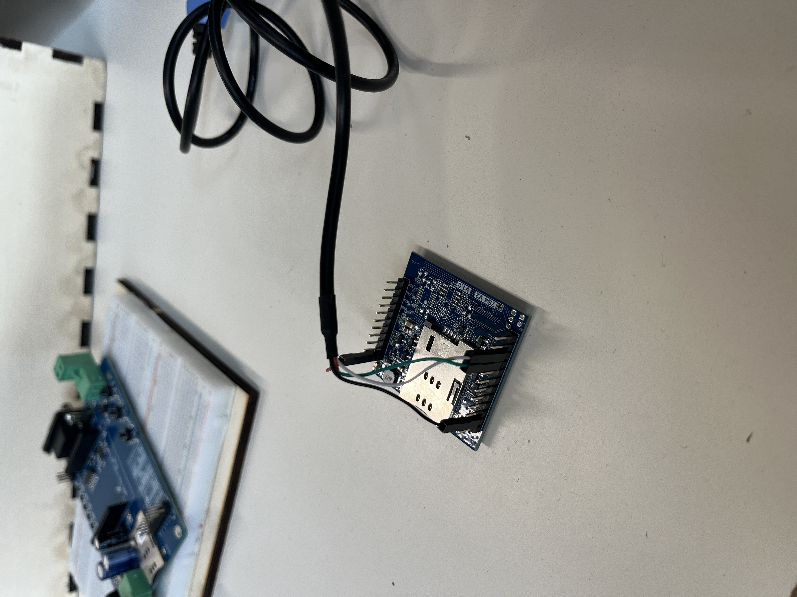
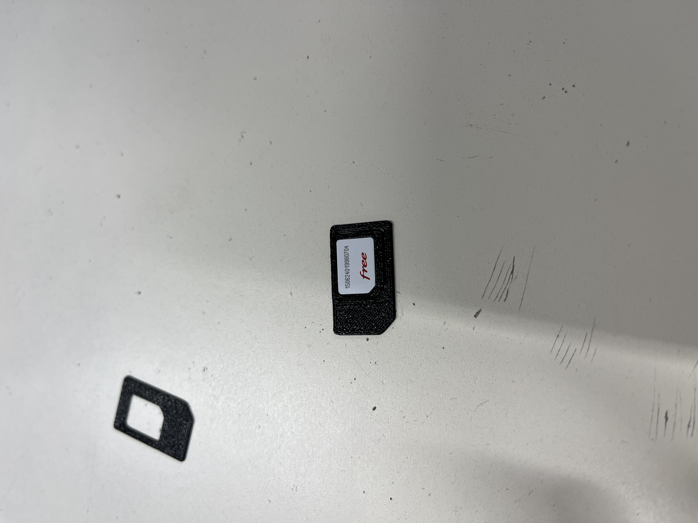
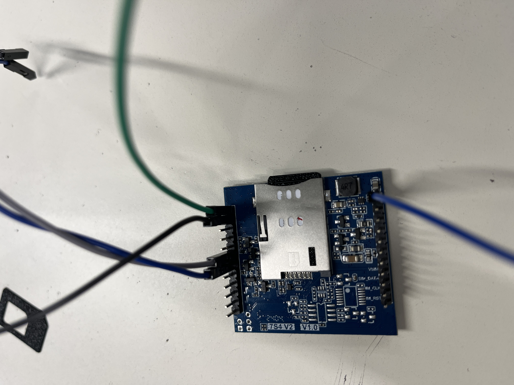

# Compte Rendu Semaine 5 / W48

## Communication 

Pour ne pas dépendre de l'ordinateur de mon collègue Matthis pour la configuration du GSM, j'ai de nouveau recherche les bons drivers de communication USB-Serie avec le GSM WH-LTE-7S1-E et j'ai mis la main sur un [tuto] (https://github.com/theAmberLion/Prolific?tab=readme-ov-file) qui m'explique comment avoir la bonne version du drivers pour communiquer avec la carte sous Windows 11.
Desormais, on configure la liaison SMS avec le logiciel fournis [USR-CAT1] (https://www.pusr.com/support/downloads/USR-CAT-1-Setup-Software.html). En suivant le [Hardware-Manual] (../../Ressource/User Manual/User-Manuel-WH-LTE-7S1-E.pdf) pour configurer le SMS mode en ajoutant notre numéro de téléphone. On réussi à communiquer via le terminal mais une erreur survient, il ne détecte pas la SIM fournis. On a bien le bon adaptateur, Le problème est que la Carte SIM avait un mot de passe. On a donc supprimer le code PIN à l'aide d'un téléphone portable. 
Après avoir résolu ce problème, le module GSM à réussi à detecter la SIM mais une nouvelle erreur est intervenue " Net Reg Fail ". Cela signifi que le module detecte les antennes autour de lui mais n'a pas l'autorisation de s'y connecter. Cela peut être la cause de plusieurs chose. 
    - le signal est trop faible
    - Problème de configuration APN, c'est à dire le fournisseur d'accés

Pour communiquer avec le GSM on utilis des commandes AT, le constructeur fournis une liste de [commande] (../../Ressource/Other/4G-CAT1-AT-Command-Manual.pdf) sur le site du constructeur.

La solution du problème était tout autre. Le GSM n'a pas d'antenne intégré donc a fallu en ajouter une. Grâce à cela on a pu envoyer un SMS au module 

## Résolution du problème
 
 Après plusieurs essais et plusieurs drivers installés, le problème était que les drivers étaient incompatibles avec ma version windows actuelle (Windows 11). Il a fallu installer les drivers sur le PC de Matthis qui tourne sous Windows 10. Grâce à ça, on a pu voir les options disponibles pour la transmission. De plus, Matthis a réussi à communiquer en série avec le GSM et l'ESP-32.
Pour la transmission des données, on a plusieurs modes : HTTP, MQTT, SMS, Transparent. Puisque nous voulons envoyer nos données à un appareil tier, la solution MQTT nous semble la plus cohérente et la plus formatrice. D'après le manuel Utilisateur du constructeur du GSM, on peut utiliser AWS pour la connexion entre les Appareils. Il faudra se pencher dessus.

## Envoi des données du sonar vers le GSM 

Maintenant, on essaie d'envoyer les données du sonar sur le GSM. Pour cela, Matthis a eu des soucis au niveau de l'alimentation.

## Création d'un adaptateur SIM

Notre GSM utilise un format de SIM standard (utilisé dans les années 2000), or la carte SIM que l'on nous a fournie est une NANO-SIM. C'est pourquoi nous allons chercher un fichier 3D qui modélise un tel adaptateur. J'ai trouvé [celui-ci] ( https://makerworld.com/fr/models/662271-3d-printable-sim-card-adapter-nano-micro-mini#profileId-589458).
Je l'ai imprimé au FabLab du campus 

## Prochaine séance
 Réussir à transmettre les données grâce à la connexion réseau (SIM) et configurer la connexion MQTT