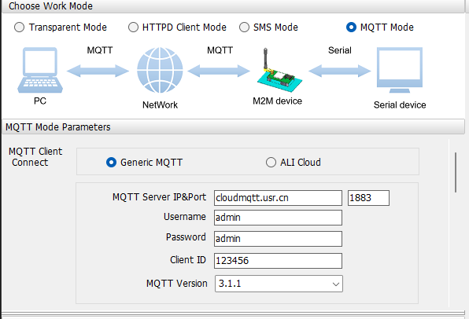
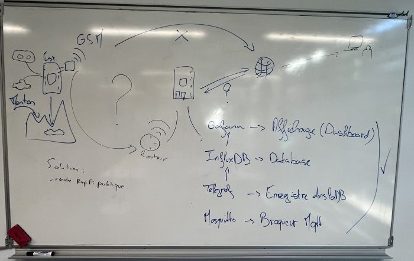

# Compte Rendu Semaine 5 / W48 (28/11)

## Alimentation du GSM

Comme annoncé dans le rapport précédent, le point de départ de cette séance était de correctement alimenter notre GSM. En demandant au prof une alimentation supplémentaire (au lieu de la fabriquer), nous avons pu utiliser la carte de test fournie avec le GSM, un [USR-7SX-EVK](https://shop.usriot.com/serial-to-2G/3G/4G-module-evaluation-board-7SX-EVK.html). Cette carte permet de simplifier les branchements de la carte à l'aide de port dédié au lieu d'utiliser les pins de la puce.
Après avoir mis en place la puce sur la carte et effectué les branchements nécessaires (branchement du port série au port USB de mon ordinateur). Le module me renvoyait des lignes vides, comme s'il avait du mal à communiquer. En convertissant l'affichage de sortie en hexadécimal, je me suis aperçu que je recevais des lignes de 0 de manière répétée. Cela était dû au fait que je n'avais pas connecté le GND du câble de liaison USB-Serie, une erreur bête mais fatale. La communication était alors impossible.

## Communication avec le module en mode SMS

Après avoir réglé ce problème, un autre est survenu. Les commandes AT de contrôle ne fonctionnaient pas. Peu importe les commandes que j'essayais d'écrire manuellement renvoyaient la même erreur "+CME ERROR:58". Cette erreur signifie qu'il y avait une erreur de syntaxe. Sur l'outil que j'utilise, des boutons sont utilisés comme macros, ils écrivent une suite de commandes AT pour configurer le GSM. J'ai donc essayé de taper ces commandes manuellement mais cela me renvoyait encore le code d'erreur 58. Les commandes tapées manuellement et via la macro étaient identiques selon le code ASCII, cependant en hexadécimal, les codes étaient différents.
En effet, les commandes utilisées via la macro respectaient une certaine syntaxe. A la fin de chaque commande, les codes 0D 0A étaient présents. Après des recherches, ces codes correspondent aux caractères "\"r" et "n", utilisés en programmation.Ces caractères signalent au GSM que la commande entrée est terminée. Après avoir recherché dans le logiciel, une option permet d'ajouter ces caractères à la fin de chaque commande avant l'envoi vers le GSM. Après ça, la communication avec le GSM était fonctionnelle. Cependant seules les commandes utilisées dans le [lexique propriétaire] (../../Ressource/Other/4G-CAT1-AT-Command-Manual.pdf) étaient reconnus.

## Problème d'envoie SMS

Après avoir réglé ce problème, la suite logique était d'envoyer un SMS avec le GSM. Bien qu'il puisse recevoir des SMS, il n'arrive pas à envoyer de SMS vers mon numéro personnel. D'après nous, ce problème vient du fait que le format du numéro de téléphone est mauvais. En effet, j'ai rentré mon numéro personnel dans 3 formats différents ("+336...", "336..." mais également "0033..") mais aucun des 3 formats n'a fonctionné.
On a décidé de passer directement à la liaison MQTT.

## Configuration MQTT

En configurant la liaison MQTT, on s'est rendu compte que le GSM devait être connecté à un serveur avec une IP fixe. Cependant on ne savait pas comment s'y prendre

Après s'être consulté, on a fait un schéma récapitulatif du projet pour connaître les options possibles et se situer dans le projet.

## Solution

La solution qui a été décidée est celle d'emprunter la salle réseau pour avoir une IP fixe et rendre l'IP du Raspberry PI publique afin qu'on puisse s'y .

## Prochaine séance

L'objectif de cette séance sera de configurer le serveur MQTT pour la liaison.
