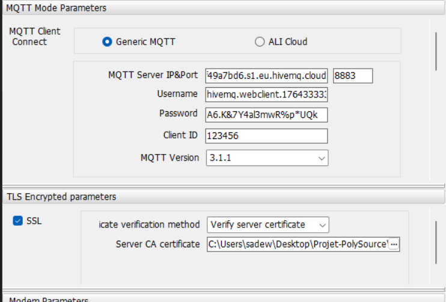

# Compte Rendu Semaine 6 / W50 (11/12)

## Configuration du serveur MQTT

Pour travailler sur notre serveur, on a décidé de se rendre dans la salle réseau de l'établissement pour explorer les différentes pistes de connexion entre le Raspberry Pi ( serveur MQTT) et le transmetteur GSM.
En recherchant sur le web différentes solutions de connexion vers un serveur MQTT via l'extérieur (comme [celle-ci](https://gist.github.com/gyassine/a5eda1c64557baa60cd563f22ac96c0d#bonuses))On s'est rendu compte que l'usage de la salle réseau ne nous avancerait pas énormément. En effet, cette solution parle de créer un nom de domaine à DNS Dynamique en utilisant une solution telle que DuckDNS, un service gratuit. Cette solution permettrait de faire d'associer notre adresse IP de routeur au nom de domaine de DuckDNS. Une solution simple pour un usage domestique.
Cependant, ce service nécessite une connexion avec une IP fixe entre le routeur et le périphérique (entre une box wifi et un ordinateur par exemple). Or, on utilise le réseau de l'université, donc implémenter une telle solution est compliqué. On s'est donc orienté vers une autre solution, celle d'installer un brocker sur une solution cloud externe, ce qui nous permettrait de nous connecter partout.

## Brocker cloud (HiveMQ)

On a décidé d'utiliser la solution du brocker HiveMQ  qui est une solution MQTT fiable et reconnue pour la communication entre machines via MQTT. Dans un premier temps, mon collègue Baptiste a configuré de son côté le brouillon MQTT de HiveMQ pour notre projet. Après cela, j'ai configuré la connexion MQTT avec le GSM.

## Configuration MQTT

Pour configurer la liaison, il fallait renseigner les informations suivantes
- Server IP&Port : Dans ce champ, on renseigne le nom du serveur MQTT ainsi que le port que l'on utilise. On utilise le port 8883 car celui-ci permet d'avoir une communication chiffrée entre le périphérique et le serveur (SSL/TLS)
- Le nom d'utilisateur utilisé pour la configuration du serveur
- Le mot de passe

Les deux derniers champs sont requis pour accéder au serveur 
Pour communiquer entre eux, le serveur et les périphériques doivent écrire leur message sur un topic défini.Chaque appareil qui a accès à un topic peut lire les messages qui y sont transcrits. On a aussi des topics d'écriture.
On doit alors aussi configurer les bons topics. Pour le projet, nous avons configuré le topic "polysource/monitoring".

Après avoir configuré le GSM avec les informations, nous n'avons pas réussi à établir une communication entre le GSM et le serveur MQTT. On ne sait pas d'où peut venir ce problème car nous avons essayé d'envoyer un message sur un topic via un autre appareil ( ordinateur) et nous avons réussi à communiquer

## Prochaine séance

Essayer de régler le problème de connexion.
