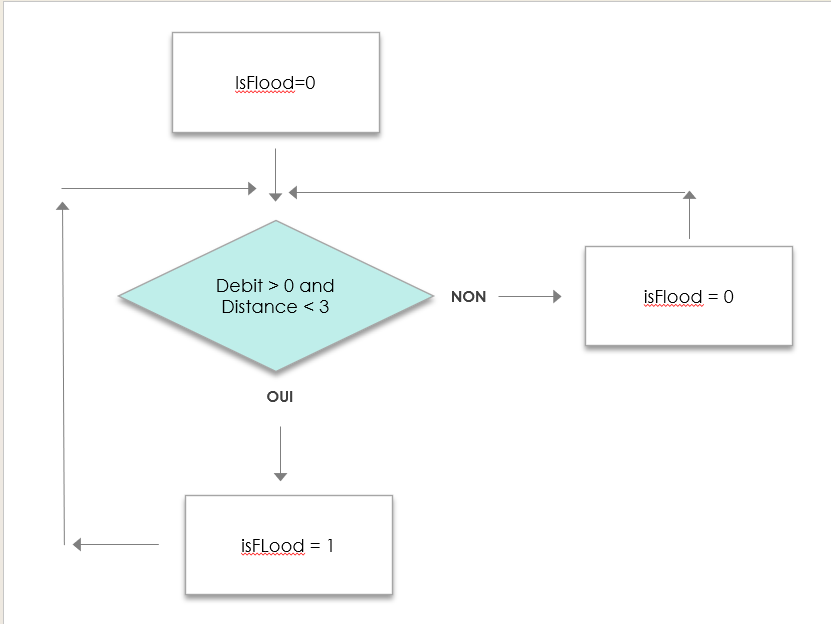

# Compte Rendu Semaine 7 / W3 (20/01/2026)

## Creation des slides et réunion de groupe

Cette journée était la première où toute l'équipe était réunie depuis les vacances. C'était l'occasion d'échanger et de préparer la présentation du projet prévue pour le mercredi 21/01. Bien que certains membres aient avancé sur la slide, il fallait rectifier et mettre en commun nos visions et répartir les temps de parole.
Il a été décidé que chacun allait parler de la partie sur laquelle il a travaillé, ce qui est assez logique.

## Problème de Raspberry PI

Lorsque nous avons voulu continuer notre progression (Connection MQTT avec le module WH-LTE-7S1-E), le Raspberry n'arrive pas à booter sur la carte SD associée. En effet, la carte restait bloquée sur l'écran de boot et la led de lecture de la carte SD ne clignotait pas, ce qui traduit un dysfonctionnement de lecture. Ce problème était important car cela signifie que toute la configuration était perdue. Dans un premier temps, nous avon essayer de récupérer les données de la carte SD avec un autre PC mais sans succès. Il a donc été décidé de re-flasher un nouvel OS sur la carte et de tout reconfigurer pour que l'on puisse continuer à travailler. Ce problème nous a pris énormément de temps à résoudre, le projet n'a pas beaucoup avancé.

## Modif du code pour boolean

En parallèle, l'équipe en charge de l'affichage des données sur un site web nous a demandé d'ajouter dans notre programme une variable booléen (int car nous programmons en C) pour communiquer le fait que la source déborde. Voici un résumé de ce qu'il a été ajouté dans le code sous forme de diagramme.

## Prochaine séance

Puisque le problème du Raspberry a été résolu, il faut à présent réussir à communiquer avec le GSM.