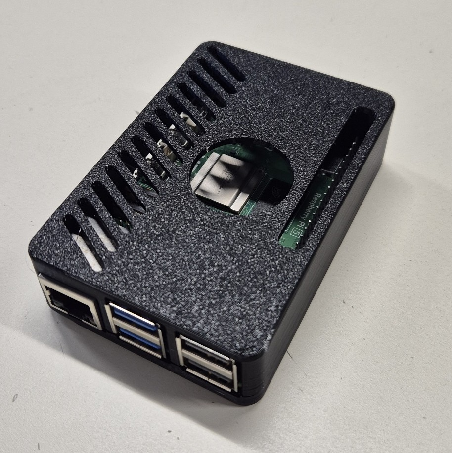

# Séance du 27/11/2025

## 🎯 Objectif de la séance

* Etablir la connexion entre l'ESP32 et le Raspberry Pi via MQTT.

---

## 🛠️ Réalisations 

*Figure 1 : Intégration du Raspberry Pi 5 dans son boîtier imprimé en 3D.*

### Connexion ESP32 → Mosquitto

Cette séance a été principalement consacrée à l'investigation de la connexion entre l'ESP32 et le broker MQTT Mosquitto hébergé sur le Raspberry Pi. 

Nous n'avons pas réussi à établir la connexion entre l'ESP32 et le broker MQTT Mosquitto hébergé sur le Raspberry Pi. Le principal obstacle est la connexion réseau.

Il faut que nous rendions la raspberry pi publique sur internet pour pouvouir utiliser le module GSM de l'ESP32.

Les différentes options trouvées pour le moment sont : 

* **Redirection de port via la box internet :** Cette option n'est pas envisageable à l'école car le réseau est sécurisé et les ports que nous pourrions utiliser sont bloqués.

* **Utilisation d'un service de type "ngrok" :** Cette option permet de créer un tunnel sécurisé entre un serveur public et notre Raspberry Pi. Cependant, les services gratuits ont des limitations (temps de connexion, bande passante, etc.) qui pourraient entraver le bon fonctionnement du projet.

* **Utilisation d'un service d'hébergement cloud :** Nous pourrions envisager d'héberger Mosquitto sur un service cloud (HiveMQ, AWS, Azure, etc.) pour garantir une accessibilité constante. Cependant, cela va à l'encontre de notre objectif initial d'auto-hébergement.

* **Utilisation d'un VPN :** Cette option n'a pas été explorée pour le moment.

Nous pourrions eventuellement tester la connexion sur un reseau local en utilisant un module WiFi sur l'ESP32 afin de valider le fonctionnement de bout en bout. Mais également définir la structure des messages MQTT envoyés.

## ➡️ Prochaines séances

* Continuer à investiguer sur la connexion entre l'ESP32 et le Raspberry Pi via MQTT.
* Tester la connexion en local via WiFi.