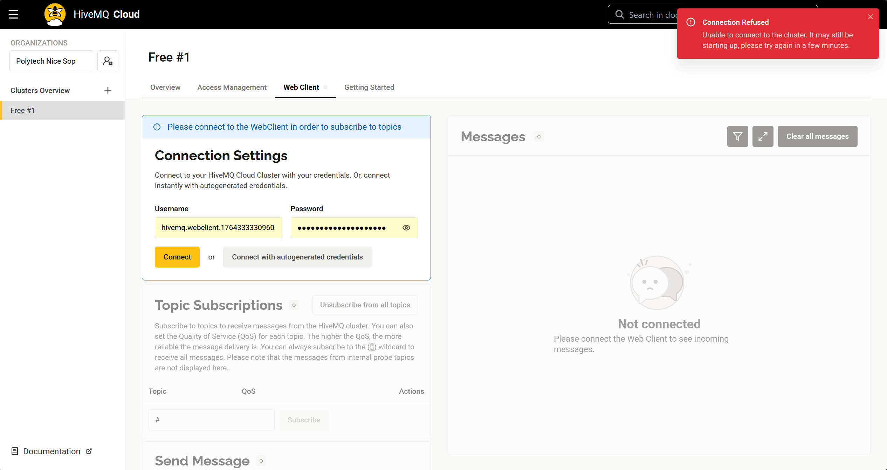

# Séance du 11/12/2025

## 🎯 Objectif de la séance

* Etablir la connexion de bout en bout entre l'ESP32 et le Raspberry Pi via MQTT.

---

## 🛠️ Réalisations

### Changement d'architecture : Passage au Cloud

Nous avons poursuivi nos travaux pour connecter l'ESP32 (module GSM) au Raspberry Pi. Compte tenu du blocage des ports entrants sur le réseau GSM et des restrictions strictes du pare-feu de l'école, la communication directe avec un broker auto-hébergé s'est avérée impossible sans configuration réseau complexe.

*L'option d'utiliser la salle réseau de l'école a été envisagée, mais elle aurait nécessité de reconfigurer le routeur à chaque début de séance, ce qui n'est pas viable pour la maintenance du projet.*

Nous avons donc pris la décision de basculer vers une architecture **Cloud Hybride** :
* **Broker MQTT :** Hébergé chez **HiveMQ Cloud** (Plan gratuit : 100 devices, 10 Go/mois).
* **Stack TIG :** Toujours hébergé sur le Raspberry Pi, qui agit maintenant comme un client qui va "chercher" les données.

*Bien que cela s'éloigne de l'objectif initial d'auto-hébergement total, c'est la solution la plus robuste pour garantir la connectivité GSM dans le contexte actuel.*

### Reconfiguration de la Stack Technique

1.  **Création du Cluster :** Configuration d'un cluster HiveMQ via le compte projet (`polysource2025@gmail.com`).
2.  **Nettoyage Docker :** Suppression du service `mosquitto` local dans `docker-compose.yml` pour libérer des ressources.
3.  **Configuration Telegraf :** Mise à jour du fichier `telegraf.conf` pour pointer vers l'URL sécurisée du Cloud (`ssl://...:8883`) avec authentification par User/Password.

### Résolution des problèmes de connexion (Firewall)

Lors des premiers tests, Telegraf refusait de se connecter à HiveMQ Cloud, et l'interface de test "Web Client" renvoyait une erreur de connexion **(voir Figure 1)**, malgré des identifiants corrects.


*Figure 1 : Message d'erreur lors de la tentative de connexion*

**Diagnostic :**
En testant la connexion via un partage de connexion 4G, l'accès a été immédiat.

**Conclusion :** Le pare-feu du réseau de l'école bloque les ports sortants non-standards :
* Le port **8883** (MQTTS) utilisé par Telegraf.
* Les ports **WebSockets** utilisés par le Web Client.

Une fois connecté sur un réseau non restreint (4G), Telegraf a pu s'authentifier et se connecter au flux de données.

### Validation de la chaîne d'acquisition

J'ai validé le fonctionnement global en simulant un capteur via le "Web Client" de HiveMQ.
* **Test :** Envoi d'un JSON ```json
  {
    "valeur": 99.9,
    "idCapteur": "Test_4G",
    "unite": "m"
  }``` sur le topic `polysource/capteurs`.
* **Résultat :** La donnée a été instantanément reçue par Telegraf, stockée dans InfluxDB et visualisée sur Grafana.

Nous n'avons pas encore réussi à connecter l'ESP32 au broker.

---

## ➡️ Prochaines séances

* Continuer à investiguer sur la connexion entre l'ESP32 et le broker HiveMQ Cloud via MQTT." 