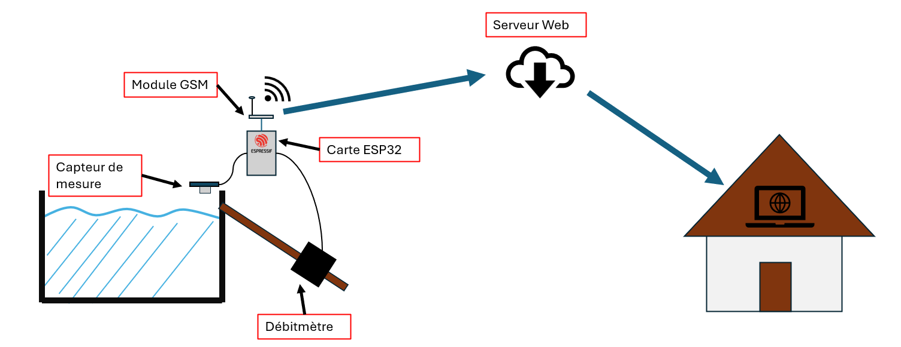

# Description du Projet

Le Projet consiste à concevoir un système qui permet de mesurer le débit de débordement ainsi que le niveau d'un bassin (notamment situé en haute montagne). Les données récoltées seraient consultables via une interface web pour que l'utilisateur puisse surveiller en temps réel le débit ainsi que le niveau à distance. Le capteur de niveau sera positionner en haut du bassin et tourné vers la surface de l'eau et le débit mettre sera positionné dans une sortie anti-debordement et mesurera le débit qui s'y écoule pour avoir une estimation du trop plein. Puisque le dispositif serait situé en montage, il utilisera le réseau mobile 4G pour communiquer et sera alimenté par une batterie, hors du réseau électrique français. Voici un schéma explicatif du projet :

## Materiels Utilisés

Pour réaliser ce projet, nous avons utilisé le matériel suivant :

- Un ESP32 [Heltec Wifi LoRa 32](https://fr.aliexpress.com/item/1005011982682740.html?src=google) Qui permettra de traiter les données récoltées et gérer le formatage des données (JSON notamment) avant de les envoyer aux serveurs via le réseau mobile 4G.
- Un module GSM 4G [USR-DR154](https://www.pusr.com/products/Lipstick-Size-4G-Modem.html) qui permettra de communiquer avec le serveur web. (Actuellement utilisé).
- Un module GSM 4G[WH-LTE-7S1-E](https://www.pusr.com/products/LTE-Cat-1-module.html) qui a été ecarté du projet car il ne fonctionnait pas correctement.
- Un module de mesure ultra son [HC-SR04](https://www.gotronic.fr/art-module-de-detection-us-hc-sr04-20912.htm) pour mesurer le niveau d'eau du bassin à l'aide d'impulsions ultrasonores.
- Un débitmètre [DIGITEN G3/4](https://www.digiten.shop/products/digiten-g3-4-water-flow-hall-sensor-switch-flow-meter-1-60l-min) qui permettre de mesurer le débit de débordement du bassin à l'aide d'impulsions PWM générées par le passage de l'eau et l'hélice du débitmètre.

Le cerveau de ce projet sera donc l'ESP32 et qui gérera les instructions ainsi que le formatage des données, tandis que les autres composants seront utilisés pour la collecte de données et la communication avec le serveur web.

## Approche et méthode employée

Pour réaliser ce projet, nous avons donc utilisé les 2 capteurs pour collecter les données du niveau d'eau et du débit de débordement, puis nous avons utilisé l'ESP32 pour traiter ces données et les formater au format JSON. Ensuite, nous avons utilisé le module USR-DR154 pour communiquer avec le brocker MQTT HiveMQ Cloud qui sert de passerelle vers le serveur web. Le serveur est hébergé sur un Raspberry Pi 4 (chez l'utilisateur) qui utilise les services Telegraf et Grafana pour affcher des graphiques d'évolution du niveau d'eau et du débit en temps réel. Nous avons choisi d'utiliser le protocole MQTT au lieur de l'HTTP car il est moins gourmand en ressources, ce qui est important pour un projet qui doit fonctionner de manière autonome pendant une longue période.
Le module GSM USR-DR154 a été configure avec une carte SIM Free fournis par l'encadrant du projet.

A ce stade du projet, réussi à collecter les données des différents capteurs, les formater au format JSON et à connecter le module GSM USR-DR154 au broker MQTT HiveMQ Cloud. 
