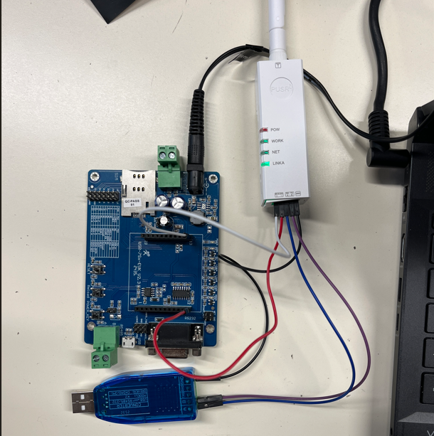
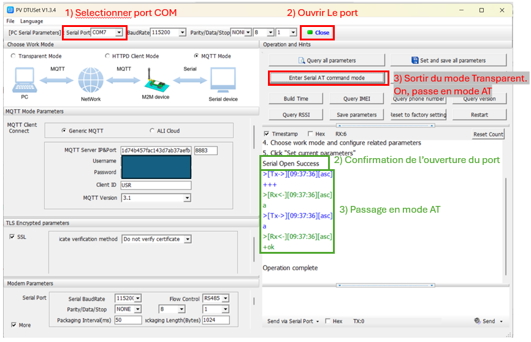
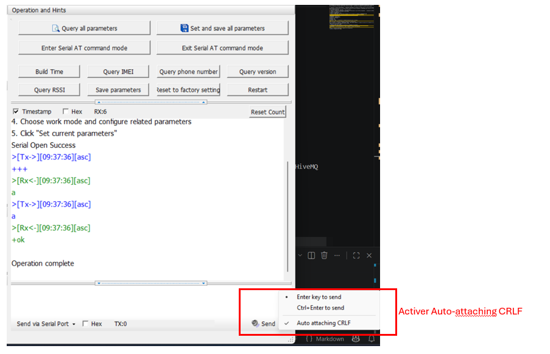
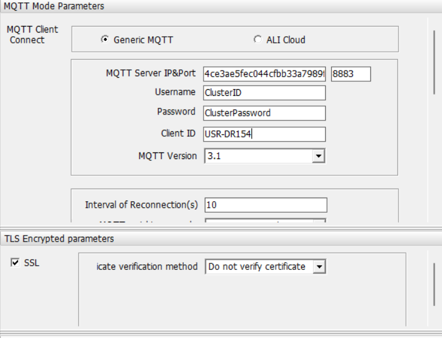
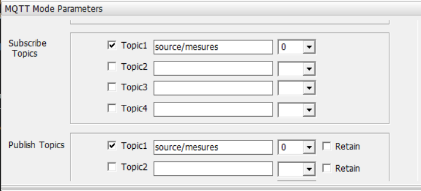
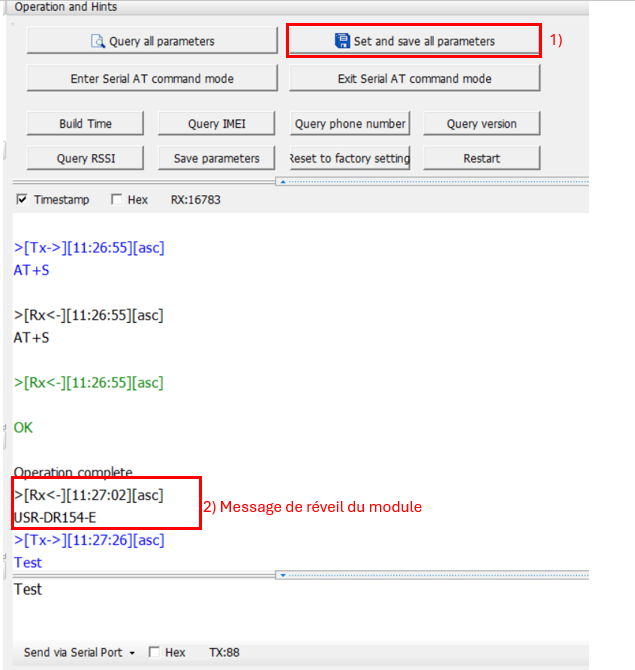

# Tutoriel configuration du module GSM USR-DR154

Ce tutoriel explique comment configurer le module GSM USR-DR154 pour qu'il puisse se connecter au broker MQTT HiveMQ Cloud et envoyer des données.

## Prérequis

Tous le matériel hardware nécessaire pour suivre ce tutoriel est disponible dans la boîte du projet.
Pour suivre ce tutoriel, vous aurez besoin de:

- Un module GSM USR-DR154.
- Un adaptateur USB-RS485 pour configurer le module GSM. Le module USR-DR154 utilise une communication série RS485 pour la configuration et la communication, il ne peut pas être configuré directement via USB. L'adaptateur USB-RS485 permet de connecter le module à un ordinateur pour la configuration.
- Carte de developpement du WH-LTE-7S1-E pour alimenter le module GSM USR-DR154, puisque le module ne peut pas être alimenté par USB.
- Alimentation 12V pour alimenter la carte de developpement du WH-LTE-7S1-E.
- Logiciel de configuration propriétaire PV-DTUSet disponible dans la section [Ressource/Executable](Ressource/Executable/USR-DR154) du dépôt GitHub du projet ou le site du [construteur](https://www.pusr.com/products/Lipstick-Size-Industrial-Cellular-Modem.html).
- Un ordinateur avec un port USB pour connecter l'adaptateur USB-RS485.

La Data sheet du module et la bibliothèque de commandes AT sont disponible dans la section [Ressource](Ressource/) du dépôt.

## Étapes de configuration

PS: Normalent le fichier de configuration Cfg.ini présent de le dossier de l'executable contient déjà la configuration du module pour ce connecter au brocker mais si non, voici les étapes à suivre pour configurer le module GSM USR-DR154:

### Démarrage du module GSM USR-DR154

1. Connectez le module GSM USR-DR154 à l'adaptateur USB-RS485 et alimenter le module avec la carte de developpement du WH-LTE-7S1-E. Il faut utilisé les broches DCIN et GND de la carte et alimenter le USR-DR154 avec ces pin. La carte s'alimente avec l'alimentation 12V. Branchez aussi les port A et B de l'adaptateur USB-RS485 aux broches A et B du module USR-DR154 respectivement.
2. Connectez l'adaptateur USB-RS485 à votre ordinateur. Voici une photo d'illustration de la connexion:


3. Ouvrez le logiciel de configuration PV-DTUSet et sélectionnez le port COM correspondant à l'adaptateur USB-RS485.
4. Cliquez sur "Connect" pour ouvrir le port COM
5. Passer en commande AT

6. Passer en mode MQTT via l'interface graphique ou en utilisant la commande:

``` Mode MQTT
AT+WKMOD=MQTT,NOR
```

**ATTENTION** : Pour que le terminal du logiciel puisse comprendre les commandes AT, il faut ajouter le caractère CRLF à la fin de chaque commmande AT. Cette option est activable dans le terminal du logiciel.

7. Charger les infos du fichier cfg.ini avec **Query all parameters**.

### Verifier si le module est connecté au réseau 4G

1. Vérifiez que le module GSM USR-DR154 est connecté au réseau 4G en utilisant différentes commandes AT. Vous pouvez utiliser les commandes suivantes pour vérifier la qualité du signal, l'attachement au réseau et le type de réseau auquel le module est connecté, ect:

```AT+CSQ // Affiche la qualité du signal, une valeur entre 10 et 15 ou plus est considérée comme une bonne qualité de signal
AT+CGATT? // Affiche si le module est attaché au réseau, la réponse doit être +CGATT: 1 pour indiquer que le module est attaché au réseau
AT+SYSINFO // doit répondre "2,LTE" pour indiquer que le module est connecté au réseau LTE
AT+CIP // Affiche l'adresse IP du module, si le module est connecté au réseau 4G, il doit avoir une adresse IP attribuée par le réseau.
```

Si le résultat n'est pas concluant, verifier l'APN de la carte Free fourni.

```AT+APN? // Affiche l'APN actuel configuré sur le module, il doit correspondre à l'APN de la carte SIM utilisée (pour Free, c'est "free")
// Si l'APN n'est pas correct, vous pouvez le configurer avec la commande suivante:
AT+APN=free
```

Reverifier les resulats des commandes précédentes après avoir configuré l'APN.
Si le module se connecte au réseau 4g, la led NET est allumée en vert.

### Configurer la connexion au broker MQTT HiveMQ Cloud

1. Configurer les paramètres de connexion MQTT en utilisant les commandes AT suivantes:

```Configuration MQTT
AT+MQTTSVR = MonAdresse.eu.hivemq.cloud,8883
AT+MQTTUSER = ClusterID
AT+MQTTPSW = ClusterPassword
AT+MQTTCID = USR-DR154
AT+SSLEN = ON
AT+SSLCFG = ON
AT+SSLAUTH = NONE // On desactive l'authentification SSL par le serveur
```

ou en utilisant l'interface graphique du logiciel de configuration.
Mais en plassant la commande : **AT+SSLCFG = ON** . Sans cette commande, le module ne peut pas se connecter au broker MQTT HiveMQ Cloud, même si les autres paramètres sont corrects.

2. Configurer les Topic Pub/Sub en utilisant les commandes AT suivantes:

```Pub/Sub
AT+MQTTPUBTP = 1,0,source/mesures,0,0,0 // pour publier des données sur le topic source/mesures
AT+MQTTSUBTP = 1,0,source/mesures,0 // pour s'abonner au topic source/mesures
```

ou avec l'interface graphique du logiciel de configuration.

3. Verifiez que le GSM est connecté au brocker MQTT HiveMQ Cloud en utilisant les commandes:

```Verification
AT+MQTTSTA // Affiche l'état de la connexion MQTT, la réponse doit être +MQTTSTA: Connected pour indiquer que le module est connecté au broker MQTT
```

Sinon regardé la led **LINKA** du module, si elle est allumée en vert, cela signifie que le module est connecté au broker MQTT HiveMQ Cloud.
4. Une fois configuré, sauvegarder la configuration avec la commande:

``` Sauvegarde de la configuration
AT+S
```

Ou via l'interface graphique avec **Set and Save all parameters**

Le module GSM USR-DR154 va sauvegarder et redémarrer, il doit se reconnecter automatiquement au réseau 4G et au broker MQTT HiveMQ Cloud après le redémarrage.
5. Une fois configuré le GSM est en mode Transparent, ce qui veut dire que le texte que vous écrivez dans le terminal sera directement envoyé au broker MQTT. Vous pouvez tester en écrivant un message dans le terminal et en vérifiant que vous le recevez sur le broker MQTT HiveMQ Cloud.
